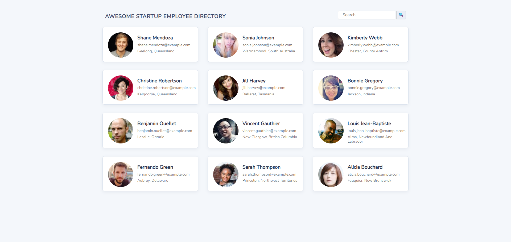

📝 Public API Request – Employee Directory

Treehouse Full Stack JavaScript Techdegree – Unit 05

This project focuses on building a dynamic employee directory that retrieves and displays user data from a public API. The application uses asynchronous JavaScript to fetch remote data, dynamically generates UI components, and allows users to interact with employee profiles through modals and search functionality.

🔗 Live: https://fullstackmachina.github.io/unit05_public_api_request/

📸 Preview image 

🎯 Project Requirements

Fetch employee data from the Random User API:

- Retrieve 12 employee profiles using the Fetch API
- Parse JSON data returned by the API
- Store employee objects in a global array

Display employees dynamically:

- Generate employee cards dynamically in the DOM
- Display profile image, name, email, and location
- Use data attributes to track employee index

Create an interactive modal window:

- Open modal when an employee card is clicked
- Display extended employee information including phone, address, and birthday
- Close modal using the close button

Implement modal navigation:

- Navigate between employees using Prev / Next buttons
- Track current employee index
- Prevent navigation outside the employee array

Manage UI updates dynamically:

- Clear and rebuild DOM elements when updating content
- Use template literals to generate dynamic markup
- Separate logic into reusable helper functions

⭐ Extra Credit Features

Search functionality:

- Live filtering of employees while typing
- Search matches employee full names
- Display an empty state when no employees match the query

Improved modal interaction:

- Navigate between employees using Prev / Next buttons
- Prevent navigation outside the employee array
- Close modal when clicking outside the modal window
- Close modal using the Escape key

Custom styling:

- Adjusted color palette and background styling
- Added subtle box shadows for cards and modal windows
- Improved hover states for employee cards and buttons

🧪 Testing & Quality Assurance

Tested interaction scenarios:

- Employee cards render correctly after API fetch
- Modal opens when clicking an employee card
- Modal displays correct employee information
- Prev / Next navigation works across all employees
- Navigation stops at first and last employee
- Modal closes using the close button
- Modal closes when clicking outside the modal
- Modal closes when pressing the Escape key
- Search filters employees dynamically
- Empty state appears when no results match the search
- No console errors in Chrome DevTools
- Code formatting and readability maintained

🧠 What I Learned in this Unit

- Working with external APIs using Fetch
- Handling asynchronous data retrieval and JSON parsing
- Building dynamic UI components using template literals
- Managing application state through arrays and indexes
- Implementing modal interfaces and UI interactions
- Creating reusable helper functions for cleaner code
- Implementing live search filtering using Array methods
- Improving UX with keyboard and overlay interactions

🛠️ Tech Stack

- JavaScript (ES6 – Fetch API & DOM API)
- HTML5
- CSS3
- Random User Public API

🔮 Possible Improvements

- Add pagination for larger datasets
- Add advanced filtering (city or country)
- Add sorting options (alphabetical / location)
- Improve animations and UI transitions
- Add loading indicators during API requests
- Add accessibility improvements (ARIA attributes)
- Refactor DOM manipulation for improved performance